---
## Front matter
lang: ru-RU
title: Отчет по лабораторной работе №1
subtitle: Операционные системы
author:
  - Семенов Богдан
institute:
  - Российский университет дружбы народов, Москва, Россия

## i18n babel
babel-lang: russian
babel-otherlangs: english

## Formatting pdf
toc: false
toc-title: Содержание
slide_level: 2
aspectratio: 169
section-titles: true
theme: metropolis
header-includes:
 - \metroset{progressbar=frametitle,sectionpage=progressbar,numbering=fraction}
---

# Информация

## Докладчик

  * Семенов Богдан
  * НКАбд-05-25, Студенческий билет: 1032255197
  * Российский университет дружбы народов

## Цель работы

Приобретение практических навыков установки операционной системы на виртуальную машину.

## Задание

1. Установка VirtualBox
2. Установка необходимого ПО
3. Первоначальная настройка ОС

---

## Создание виртуальной машины

В терминале запустим liveinst. (рис. 1).

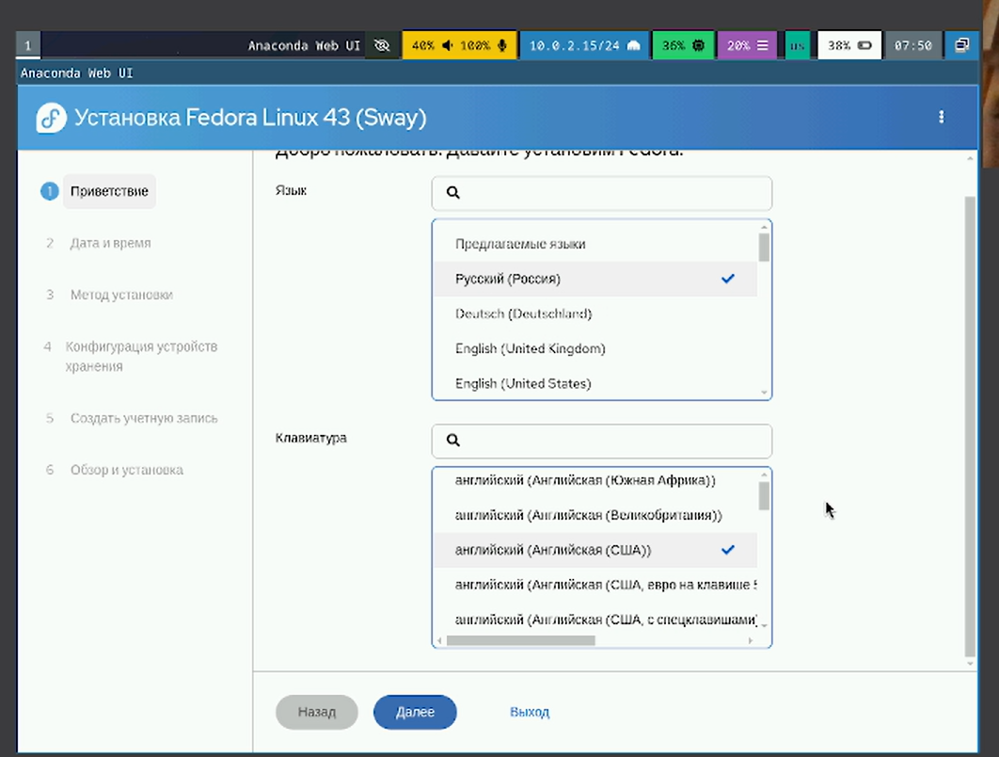{#fig-001 width=70%}

##

Выберем язык интерфейса и перейдем к настройкам установки ОС. по желанию корректируем часовой пояс, раскладку клавиатуры, место установки ОС оставим по умолчанию, установим имя и пароль для пользователя root, установим имя и пароль для пользователя, зададим сетевое имя компьютера. (рис. 2).

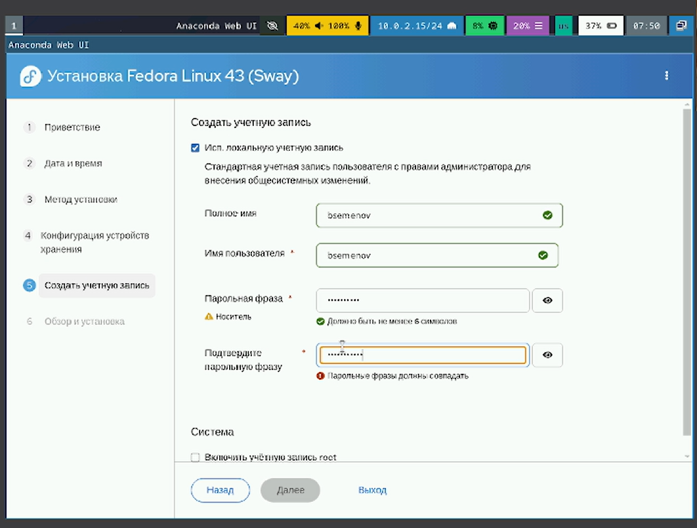{#fig-002 width=70%}

##

После завершения установки ОС корректно перезапустим ВМ., отключим носитель информации с образом. (рис. 3).

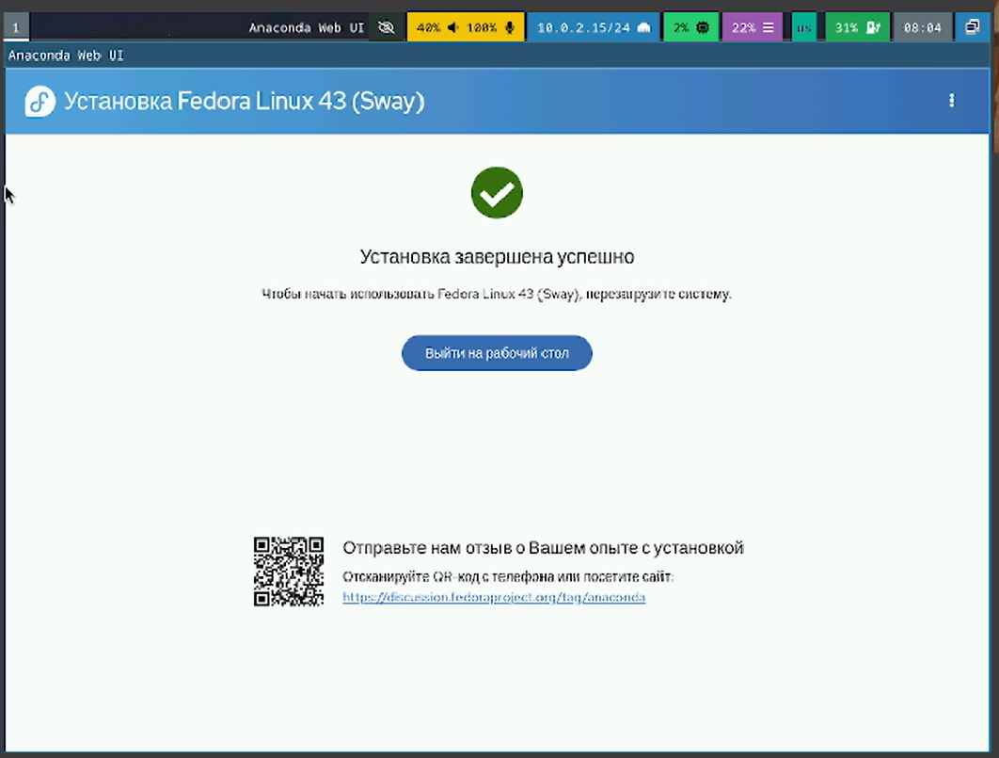{#fig-003 width=70%}

##

Установим средства разработки (рис. 4).

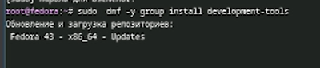{#fig-004 width=70%}

##

Обновление репозиториев командой `sudo dnf update` (рис. 5).

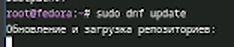{#fig-005 width=70%}

##

Установка `tmux` (рис. 6).

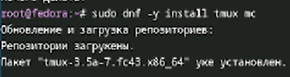{#fig-006 width=70%}

##

Установка `kitty` (рис. 7).

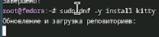{#fig-007 width=70%}

##

Установка Автоматического обновления (рис. 8).

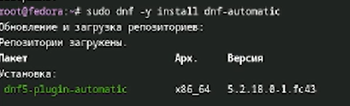{#fig-008 width=70%}

##

Запускаем таймер (рис. 9).

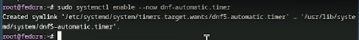{#fig-009 width=70%}

##

Отключение SELinux, замена на `SELINUX=permissiv` (рис. 10).

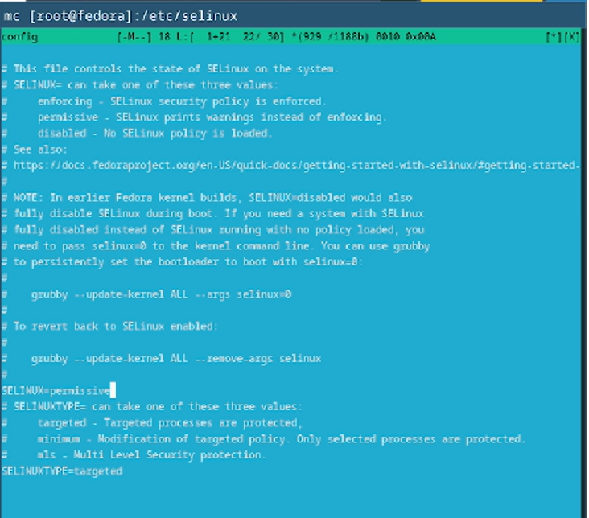{#fig-010 width=70%}

##

Запуск терминалького мультиплексора tmux (рис. 11).

{#fig-011 width=70%}

##

Создание конфигурального файла (рис. 12).

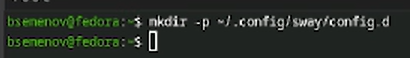{#fig-012 width=70%}

##

Продолжение конфига (рис. 13).

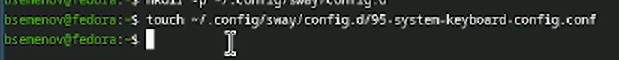{#fig-013 width=70%}

##

Отредактируем конфиг файл (рис. 14).

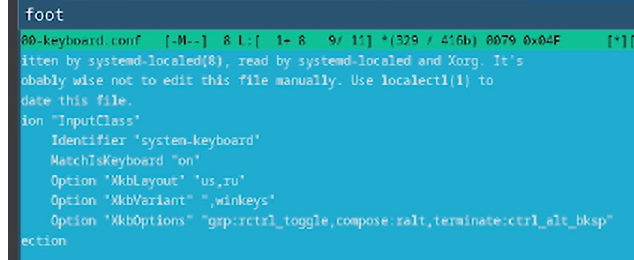{#fig-014 width=70%}

##

Перезагрузка виртуальной машины (рис. 15).

{#fig-015 width=70%}

##

Установка средства `pandoc` для работы с языком разметки `Markdown` (рис. 16).

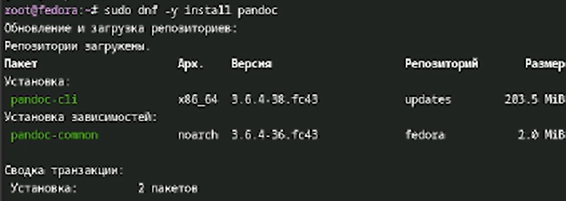{#fig-016 width=70%}

##

Скачали файл `pandoc-crossref-Linux` (рис. 17).

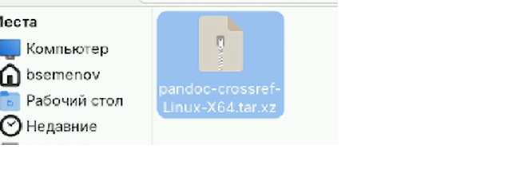{#fig-017 width=70%}

##

Проанализируем последовательность загрузки системы с помощью `dmesg | less` (рис. 18).

{#fig-018 width=70%}

##

Можем использовать поиск с помощью `grep` (рис. 19).

{#fig-019 width=70%}

## Выводы

В ходе выполнения лабораторной работы я приборел навыки установки виртуальной машины на VirtualBox, установил ряд пакетов и настроил ОС для дальнейшей работы

:::
