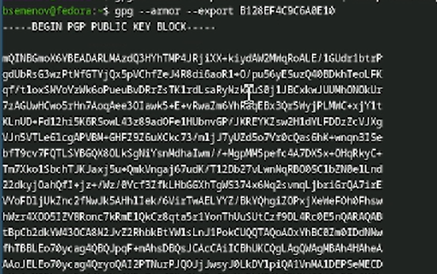
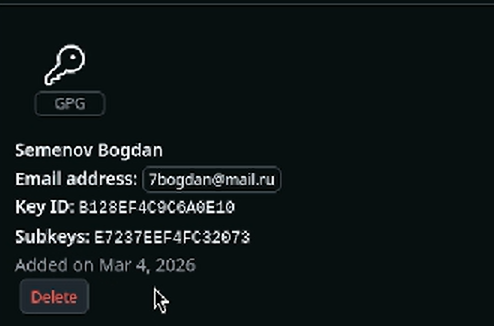
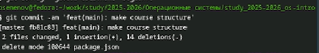
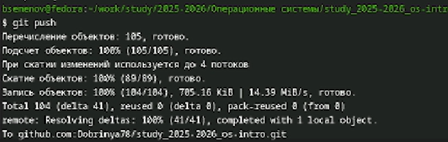

---
## Front matter
lang: ru-RU
title: Отчет по лабораторной работе №2
subtitle: Операционные системы
author:
  - Семенов Богдан
institute:
  - Российский университет дружбы народов, Москва, Россия

## i18n babel
babel-lang: russian
babel-otherlangs: english

## Formatting pdf
toc: false
toc-title: Содержание
slide_level: 2
aspectratio: 169
section-titles: true
theme: metropolis
header-includes:
 - \metroset{progressbar=frametitle,sectionpage=progressbar,numbering=fraction}
---

# Информация

## Докладчик

  * Семенов Богдан
  * НКАбд-05-25, Студенческий билет: 1032255197
  * Российский университет дружбы народов

## Цель работы

Целью работы является изучение работы и применения средств контроля версий и освоение умения по работе с git.

## Задание

Создать базовую конфигурацию для работы с git, ключ ssh, ключ pgp, подписи git, локальный каталог для выполнения и прикрепления заданий по предмету.

---

## Настройка 

##

Для начала работы переходим на суперпользователя с помощью команды `sudo -i` (рис. 1).

{#fig-001 width=70%}

##

Установим git при помощи команды `dnf install git` (рис. 2).

{#fig-002 width=70%}

##

Установим gh при с помощью команды `dnf install gh` (рис. 3).

{#fig-003 width=70%}

##

Создание ключа ssh с помощью комады `ssh-keygen -t rsa -b 4096` (рис. 4).

{#fig-004 width=70%}

##

Продолжение создание ключа ssh командой `ssh-keygen -t` (рис. 5).

{#fig-005 width=70%}

##

Создание gpg ключа с помощью команды `gpg --armor --export B128EF4C9C6A0E10` ([рис. 6).

{#fig-007 width=70%}

##

Подтверждение создания ssh ключа (рис. 7).

{#fig-008 width=70%}

##

Подтверждение создания gpg ключа (рис. 8).

{#fig-009 width=70%}

##

Создание и переход (рис. 9).

{#fig-010 width=70%}

##

Создаем копию импользуя команду `git clone` (рис. 10).

{#fig-011 width=70%}

##

Добавляем изменения используя команду `git add .` (рис. 11).

{#fig-012 width=70%}

##

Создаем коммит всех изменений (рис. 12).

{#fig-013 width=70%}

##

Отправляем коммиты из локального в удаленный (рис. 13).

{#fig-014 width=70%}

## Выводы

Выполнение этой лабораторной работы обеспечило меня необходимыми навыками для эффективной работы с Git. Теперь у меня настроены все каталоги курса, готовы SSH и GPG ключи, и я успешно авторизован на GitHub, что значительно упростит дальнейшее взаимодействие с проектами.

:::
