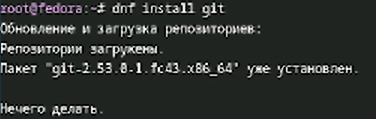
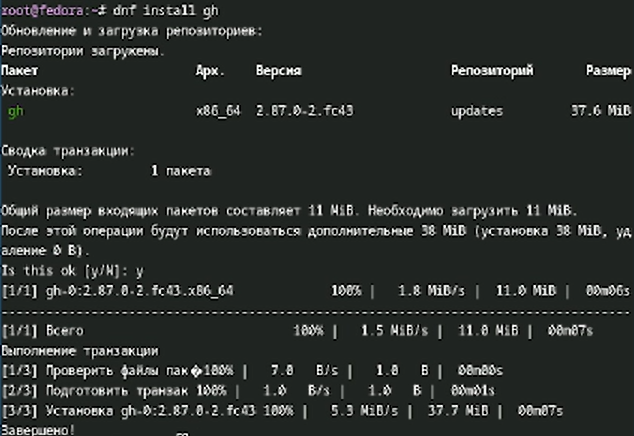
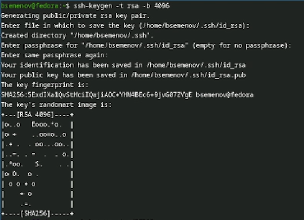
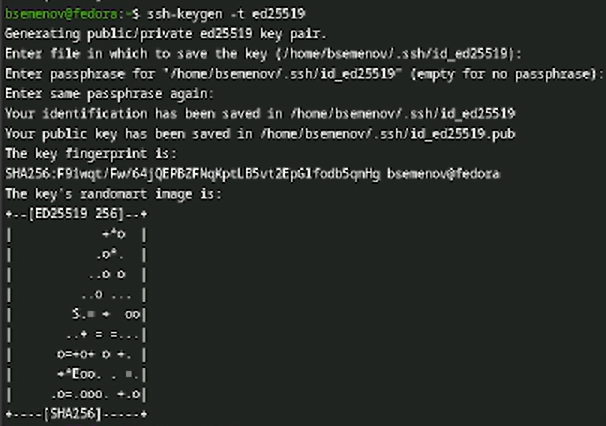
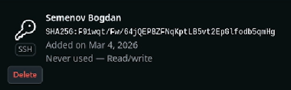
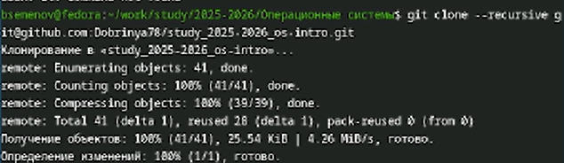

---
## Author
author:
  name: Дмитрий Сергеевич Кулябов
  degrees: DSc
  orcid: 0000-0002-0877-7063
  email: kulyabov-ds@rudn.ru
  affiliation:
    - name: Российский университет дружбы народов
      country: Российская Федерация
      postal-code: 117198
      city: Москва
      address: ул. Миклухо-Маклая, д. 6

## Title
title: "Лабораторная работа 2"
subtitle: "Архитектура Компьютера"
license: "Семенов Богдан"
---

# Цель работы

Целью работы является изучение работы и применения средств контроля версий и освоение умения по работе с git.

# Задание

Создать базовую конфигурацию для работы с git, ключ ssh, ключ pgp, подписи git, локальный каталог для выполнения и прикрепления заданий по предмету. 

# Теоретическое введение

Системы контроля версий (VCS) — это инструменты, незаменимые для командной разработки проектов. Они позволяют нескольким участникам совместно работать над одним проектом, отслеживая и управляя всеми изменениями. Основной код проекта обычно хранится в центральном или удаленном хранилище, доступном для всех разработчиков. VCS дают возможность фиксировать изменения, объединять работу разных людей, а также возвращаться к любой предыдущей версии проекта.

Традиционные VCS используют централизованный подход: все файлы хранятся в одном репозитории, а специальный сервер управляет версиями. Пользователи получают нужные файлы, вносят изменения и загружают обновленные версии обратно. При этом старые версии сохраняются, а для экономии места сервер может хранить только различия между версиями (дельта-компрессия).

VCS эффективно справляются с конфликтами, возникающими при одновременной работе над одним файлом. Они позволяют автоматически или вручную объединять изменения, выбирать нужные версии, отменять правки или временно блокировать файлы для эксклюзивного доступа.

Помимо базовых функций, VCS предлагают и более продвинутые возможности, например, работу с параллельными ветками разработки, сохраняя общую историю и индивидуальные изменения каждой ветви. Также они ведут подробный журнал изменений, показывающий, кто, когда и что изменил.

В отличие от централизованных, распределенные VCS не требуют единого центрального хранилища. Среди популярных централизованных систем — CVS и Subversion, а среди распределенных — Git, Bazaar и Mercurial. Их основные принципы схожи, различия заключаются преимущественно в командах.

# Выполнение лабораторной работы

1) Для начала работы переходим на суперпользователя с помощью команды `sudo -i` ([рис. @fig-001]).

{#fig-001 width=70%}

2) Установим git при помощи команды `dnf install git` ([рис. @fig-002]).

{#fig-002 width=70%}

3) Установим gh при с помощью команды `dnf install gh` ([рис. @fig-003]).

{#fig-003 width=70%}

4) Создание ключа ssh с помощью комады `ssh-keygen -t rsa -b 4096` ([рис. @fig-004]).

{#fig-004 width=70%}

5) Продолжение создание ключа ssh командой `ssh-keygen -t` ([рис. @fig-005]).

{#fig-005 width=70%}

6) Создание gpg ключа с помощью команды `gpg --armor --export B128EF4C9C6A0E10` ([рис. @fig-007]).

{#fig-007 width=70%}

7) Подтверждение создания ssh ключа ([рис. @fig-008]).

{#fig-008 width=70%}

8) Подтверждение создания gpg ключа ([рис. @fig-009]).

{#fig-009 width=70%}

9) Создание и переход ([рис. @fig-010]).

{#fig-010 width=70%}

10) Создаем копию импользуя команду `git clone` ([рис. @fig-011]).

{#fig-011 width=70%}

11) Добавляем изменения используя команду `git add .` ([рис. @fig-012]).

{#fig-012 width=70%}

12) Создаем коммит всех изменений ([рис. @fig-013]).

{#fig-013 width=70%}

13) Отправляем коммиты из локального в удаленный ([рис. @fig-014]).

{#fig-014 width=70%}

# Выводы

Выполнение этой лабораторной работы обеспечило меня необходимыми навыками для эффективной работы с Git. Теперь у меня настроены все каталоги курса, готовы SSH и GPG ключи, и я успешно авторизован на GitHub, что значительно упростит дальнейшее взаимодействие с проектами.

# Список литературы{.unnumbered}

