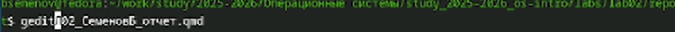
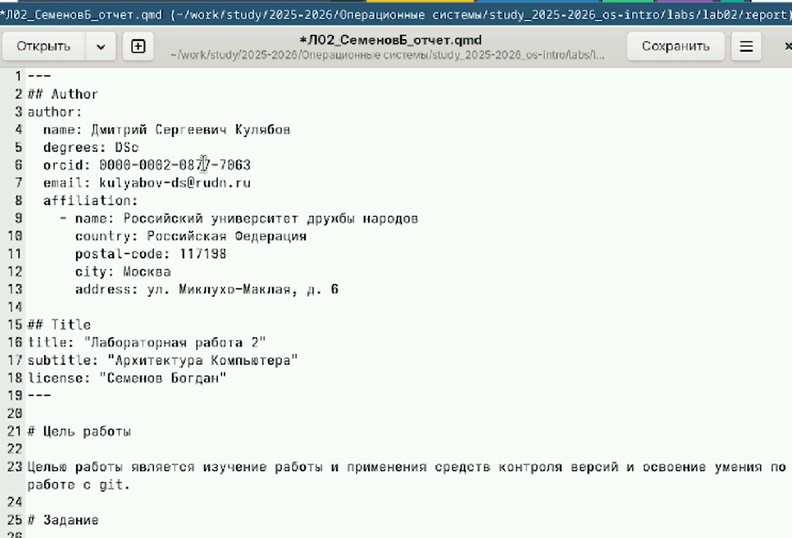

---
## Front matter
lang: ru-RU
title: Отчет по лабораторной работе №4
subtitle: Операционные системы
author:
  - Семенов Богдан
institute:
  - Российский университет дружбы народов, Москва, Россия

## i18n babel
babel-lang: russian
babel-otherlangs: english

## Formatting pdf
toc: false
toc-title: Содержание
slide_level: 2
aspectratio: 169
section-titles: true
theme: metropolis
header-includes:
 - \metroset{progressbar=frametitle,sectionpage=progressbar,numbering=fraction}
---

# Информация

## Докладчик

  * Семенов Богдан
  * НКАбд-05-25, Студенческий билет: 1032255197
  * Российский университет дружбы народов
  
## Цель работы

Научится оформлять отчеты с помощью языка разметки Markdown.

## Задание

Сделать отчет по предыдущей лаборторной работе в формате Markdown.

##

Переходим в нужную нам папку (рис. 1).

{#fig-001 width=70%}

##

Открываем шаблон с помощью команды gedit (рис. 2).

{#fig-002 width=70%}

##

Открываем шаблон (рис. 3).

{#fig-003 width=70%}

##

Редактируем шаблон (рис. 4).

{#fig-004 width=70%}

##

Используем команду make чтобы скомпилировать docx и pdf (рис. 5).

{#fig-005 width=70%}

##

Компилируем файлы (рис. 6).

{#fig-006 width=70%}

## Выводы

В ходе выполнения лабораторной работы я научился оформлять отчеты с помощью языка разметки Markdown.

## Список литературы
