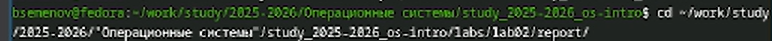
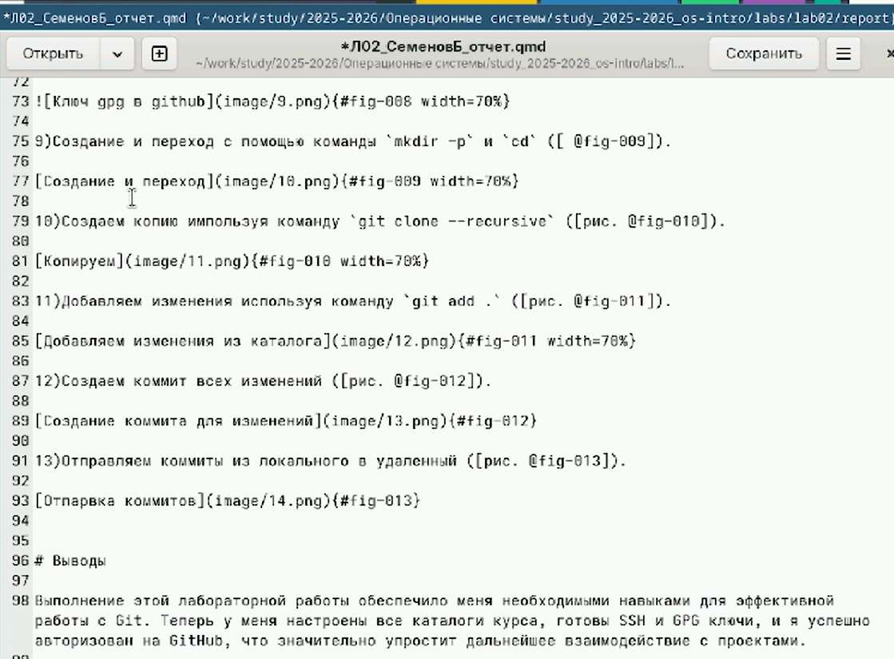
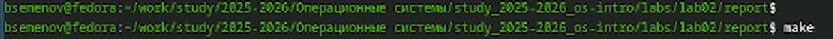
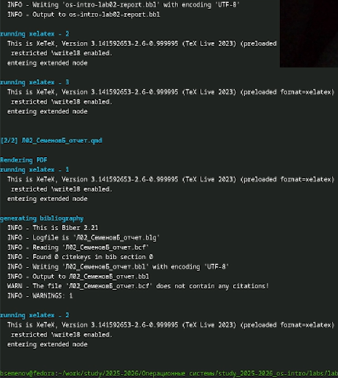

# Цель работы

Научится оформлять отчеты с помощью языка разметки Markdown.

# Задание

Сделать отчет по предыдущей лаборторной работе в формате Markdown.

# Теоретическое введение

Чтобы создать заголовок, используйте знак (#). Чтобы задать для текста полужирное начертание, заключите его в двойные звездочки. Чтобы задать для текста курсивное начертание, заключите его в одинарные звездочки. Чтобы задать для текста полужирное и курсивное начертание, заключите его в тройные звездочки. Блоки цитирования создаются с помощью символа >. Неупорядоченный (маркированный) список можно отформатировать с помощью звездочек или тире. Чтобы включить один список в другой, добавьте отступ для элементов дочернего списка. Упорядоченный список можно отформатировать с помощью соответствующих цифр. Чтобы включить один список вдругой, добавьте отступ для элементов дочернего списка. Синтаксис Markdown для встроенной ссылки состоит из части [link text], представляющей текст гиперссылки, и части (file-name.md)-URL адреса или имени файла, на который дается ссылка. Markdown поддерживает как встраивание фрагментов кода в предложение, так и их размещение между предложениями в виде отдельных огражденных блоков. Огражденные блоки кода — это простой способ выделить синтаксис для фрагментов кода. Внутри текстовые формулы делаются аналогично формулам LaTeX. Для обработки файлов в формате Markdown будем использовать Pandoc. Конкретно, нам понадобится программа pandoc, pandoc-citeproc https://github.com/jgm/pandoc/releases, pandoc crossref https://github.com/lierdakil/pandoc-crossref/releases. Преобразовать файл README.md можно следующим образом: 1pandoc README.md -o README.pdf или так 1pandocREADME.md - oREADME.docx Можно использовать следующий Makefile 1 FILES=$(patsubst%.md,%docx,$(wildcard.md))2FILES+=$(patsubst%.md, 7 %.pdf, $(wildcard .md))

# Выполнение лабораторной работы

1)Переходим в нужную нам папку ([рис. @fig-001]).

{#fig-001 width=70%}

2)Открываем шаблон с помощью команды gedit ([рис. @fig-002]).

{#fig-002 width=70%}

3)Открываем шаблон ([рис. @fig-003]).

{#fig-003 width=70%}

4)Редактируем шаблон ([рис. @fig-004]).

{#fig-004 width=70%}

5)Используем команду make чтобы скомпилировать docx и pdf ([рис. @fig-005]).

{#fig-005 width=70%}

6)Компилируем файлы ([рис. @fig-006]).

{#fig-006 width=70%}

# Выводы

В ходе выполнения лабораторной работы я научился оформлять отчеты с помощью языка разметки Markdown.

# Список литературы{.unnumbered}

