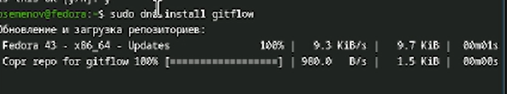
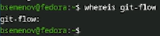
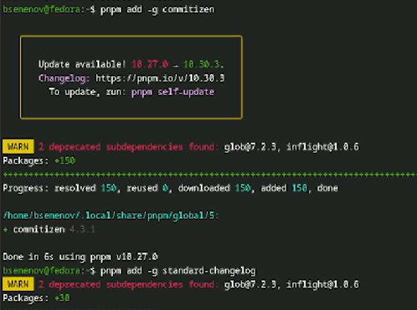
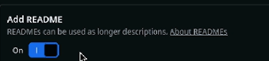
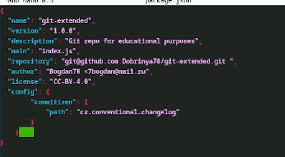
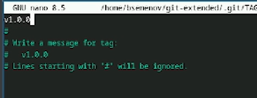
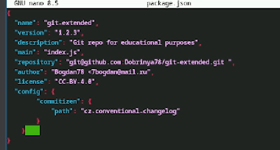
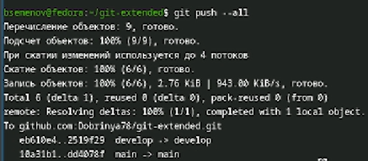

---
## Front matter
lang: ru-RU
title: Отчет по лабораторной работе №4
subtitle: Операционные системы
author:
  - Семенов Богдан
institute:
  - Российский университет дружбы народов, Москва, Россия

## i18n babel
babel-lang: russian
babel-otherlangs: english

## Formatting pdf
toc: false
toc-title: Содержание
slide_level: 2
aspectratio: 169
section-titles: true
theme: metropolis
header-includes:
 - \metroset{progressbar=frametitle,sectionpage=progressbar,numbering=fraction}
---

# Информация

## Докладчик

  * Семенов Богдан
  * НКАбд-05-25, Студенческий билет: 1032255197
  * Российский университет дружбы народов
  
## Цель работы

## Выполнение лабораторной работы

##

Установка Corp из комлекции репозитариев ([рис. 1).

{#fig-001 width=70%}

##

Продолжение установки, с помощью команды `dnf install gitflow` (рис. 2).

{#fig-002 width=70%}

##

Команда `whereis git-flow` (рис. 3).

{#fig-003 width=70%}

##

Установка программного обеспечения для семантического версионирования и общепринятых коммитов. (рис. 4).

{#fig-004 width=70%}

##

До установка (рис. 5).

{#fig-005 width=70%}

##

Запускаем nodejs (рис. 6).

{#fig-006 width=70%}

##

Форматируем коммиты (рис. 7).

{#fig-007 width=70%}

##

Включили Add README (рис. 8).

{#fig-008 width=70%}

##

Выполним команду git clone (рис. 9).

{#fig-009 width=70%}

##

Команда `git-extended/` (рис. 10).

{#fig-010 width=70%}

##

Выполнение touch README (рис. 11).

{#fig-011 width=70%}

##

Добавим новые файлы `git add .` (рис. 12).

{#fig-012 width=70%}

##

Конфигурация для пакетов nodejs (рис. 13).

{#fig-013 width=70%}

##

Файл `packege.json` (рис. 14).

{#fig-014 width=70%}

##

Выполним коммит git cz (рис. 15).

{#fig-015 width=70%}

##

Инициализируем `git-flow` (рис. 16).

{#fig-016 width=70%}

##

Меняем версию на v1.0.0 (рис. 17).

{#fig-017 width=70%}

##

Изменили версию в файле на v1.2.3 (рис. 18).

{#fig-018 width=70%}

##

Отправим данные на github `git push --all` (рис. 19).

{#fig-019 width=70%}

##

Проверка версии на github (рис. 20).

{#fig-020 width=70%}

# Выводы

В ходе выполнения лабораторной работы я приобрел навыки работы с репозиториями git.

# Список литературы
