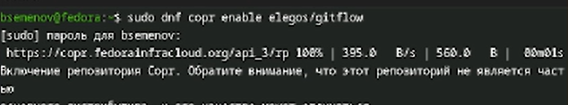
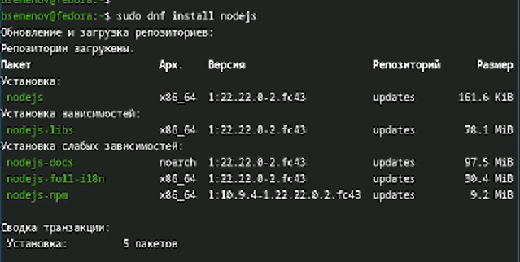
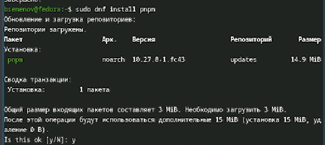
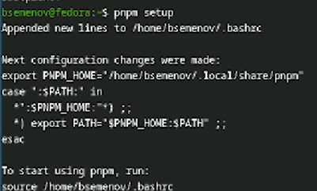
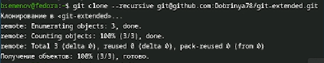
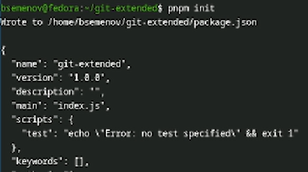
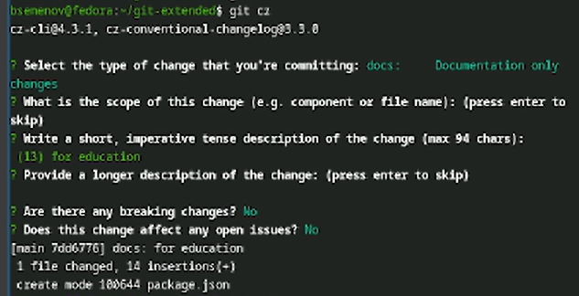
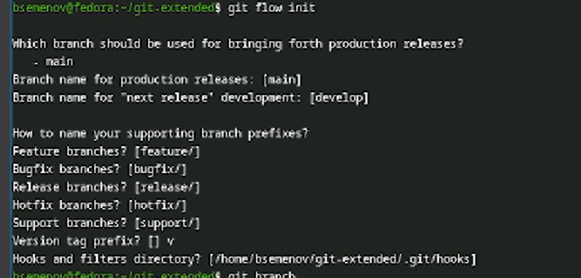
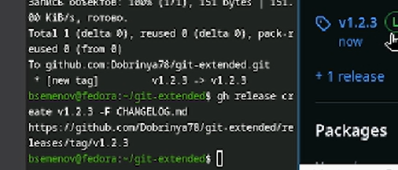

# Цель работы

Получение навков продвинутой работы с репозиторием git и релизами.

# Задание

Выполнить работу для тестового репозитария и преобразовать рабочий репозиторий в репозиторий с git-flow и conventional commits

# Теоретическое введение

Gitflow Workflow — это модель ветвления для Git, которая была опубликована и популяризована Винсентом Дриссеном. Данная модель предполагает выстраивание строгой структуры веток с учётом выпуска версий проекта. GitHub Workflow отлично подходит для организации рабочего процесса, основанного на регулярных релизах. Работа по этой модели включает создание отдельных веток для разработки новых функций, подготовки релизов, а также для срочного исправления ошибок в рабочей среде, что позволяет поддерживать стабильность основной ветки проекта на всех этапах разработки.
 
Семантическое версионирование, или SemVer, описывается в одноимённом манифесте и представляет собой систему правил для присвоения номеров версий. Кратко его можно описать следующим образом: версия задаётся в виде кортежа МАЖОРНАЯ_ВЕРСИЯ.МИНОРНАЯ_ВЕРСИЯ.ПАТЧ. Номер версии следует увеличивать по определённым правилам. МАЖОРНУЮ версию увеличивают в том случае, когда в проект вносятся обратно несовместимые изменения API. МИНОРНУЮ версию увеличивают при добавлении новой функциональности, которая не нарушает обратной совместимости. ПАТЧ-версию увеличивают, когда выполняются обратно совместимые исправления ошибок. Дополнительные обозначения для предварительных версий и билд-метаданных могут быть добавлены как расширение к основному формату МАЖОРНАЯ.МИНОРНАЯ.ПАТЧ, например, в виде суффиксов -alpha, -beta или +build.15.
 
Спецификация Conventional Commits представляет собой соглашение о том, как нужно писать сообщения коммитов. Данная спецификация полностью совместима с семантическим версионированием и даже более того — она тесно с ним связана. Conventional Commits регламентирует структуру сообщения коммита и определяет основные типы изменений, такие как feat для новой функциональности, fix для исправления ошибок, BREAKING CHANGE для изменений, нарушающих обратную совместимость, а также вспомогательные типы вроде docs, style, refactor и другие. Соблюдение этой спецификации позволяет автоматически определять следующую версию проекта в соответствии с правилами SemVer, а также генерировать changelog на основе истории коммитов, что значительно упрощает управление версиями и выпуск релизов.

# Выполнение лабораторной работы

1)Установка Corp из комлекции репозитариев ([рис. @fig-001]).

{#fig-001 width=70%}

2)Продолжение установки, с помощью команды `dnf install gitflow` ([рис. @fig-002]).

{#fig-002 width=70%}

3)Команда `whereis git-flow` ([рис. @fig-003]).

{#fig-003 width=70%}

4)Установка программного обеспечения для семантического версионирования и общепринятых коммитов. ([рис. @fig-004]).

{#fig-004 width=70%}

5)До установка ([рис. @fig-005]).

{#fig-005 width=70%}

6)Запускаем nodejs ([рис. @fig-006]).

{#fig-006 width=70%}

7)Форматируем коммиты ([рис. @fig-007]).

{#fig-007 width=70%}

8)Включили Add README ([рис. @fig-008]).

{#fig-008 width=70%}

9)Выполним команду git clone ([рис. @fig-009]).

{#fig-009 width=70%}

10)Команда `git-extended/` ([рис. @fig-010]).

{#fig-010 width=70%}

11)Выполнение touch README ([рис. @fig-011]).

{#fig-011 width=70%}

12)Добавим новые файлы `git add .` ([рис. @fig-012]).

{#fig-012 width=70%}

13)Конфигурация для пакетов nodejs ([рис. @fig-013]).

{#fig-013 width=70%}

14)Файл `packege.json` ([рис. @fig-014]).

{#fig-014 width=70%}

15)Выполним коммит git cz ([рис. @fig-015]).

{#fig-015 width=70%}

16)Инициализируем `git-flow` ([рис. @fig-016]).

{#fig-016 width=70%}

17)Меняем версию на v1.0.0 ([рис. @fig-017]).

{#fig-017 width=70%}

18)Изменили версию в файле на v1.2.3 ([рис. @fig-018]).

{#fig-018 width=70%}

19)Отправим данные на github `git push --all` ([рис. @fig-019]).

{#fig-019 width=70%}

20)Проверка версии на github ([рис. @fig-020]).

{#fig-020 width=70%}

# Выводы

В ходе выполнения лабораторной работы я приобрел навыки работы с репозиториями git.

# Список литературы
