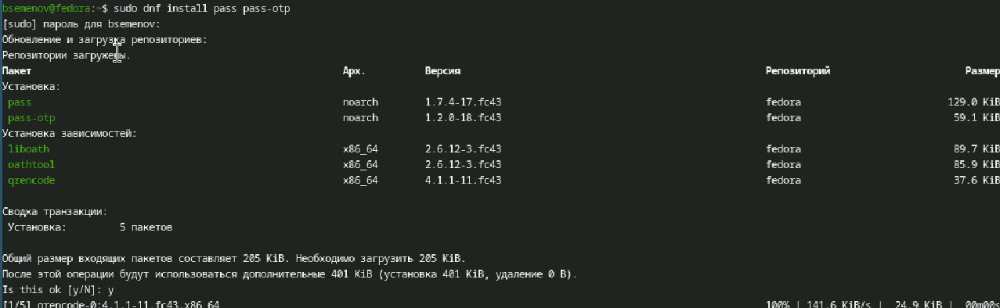
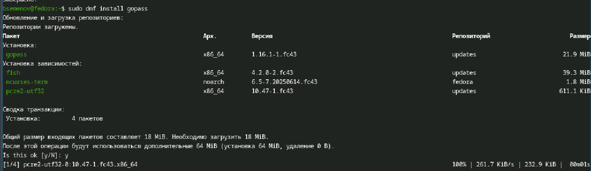
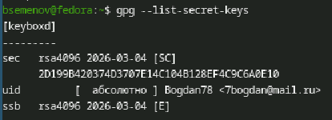
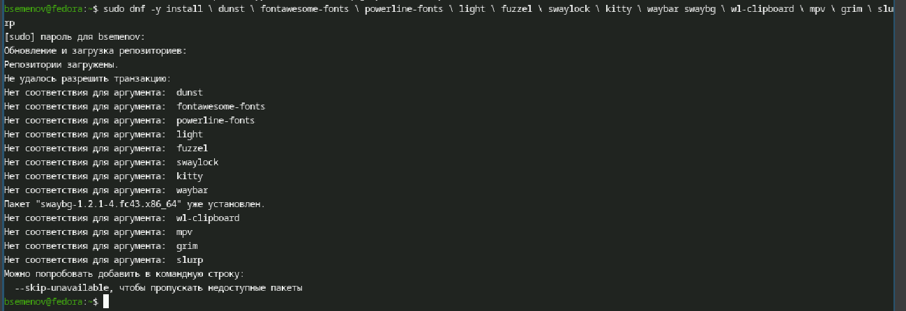

---
## Front matter
lang: ru-RU
title: Отчет по лабораторной работе №4
subtitle: Операционные системы
author:
  - Семенов Богдан
institute:
  - Российский университет дружбы народов, Москва, Россия

## i18n babel
babel-lang: russian
babel-otherlangs: english

## Formatting pdf
toc: false
toc-title: Содержание
slide_level: 2
aspectratio: 169
section-titles: true
theme: metropolis
header-includes:
 - \metroset{progressbar=frametitle,sectionpage=progressbar,numbering=fraction}
---

# Информация

## Докладчик

  * Семенов Богдан
  * НКАбд-05-25, Студенческий билет: 1032255197
  * Российский университет дружбы народов
  
## Цель работы

Настройка рабочей среды.

## Выполнение лабораторной работы

##

Установка pass (рис. 1).

{#fig-001 width=70%}

##

Установка gopass (рис. 2).

{#fig-002 width=70%}

##

Просмотр списка ключей (рис. 3).

{#fig-003 width=70%}

##

Инициализируем хранилище (рис. 4).

{#fig-004 width=70%}

##

Создадим структуру git(рис. 5).

{#fig-005 width=70%}

##

Для синхронизации выполняется следующая команда (рис. 6).

{#fig-006 width=70%}

##

Проверим статус синхронизации (рис. 7).

{#fig-007 width=70%}

##

Настройка интерфейса с браузером (рис. 8).

{#fig-008 width=70%}

##

Установка browserpass (рис. 9).

{#fig-009 width=70%}

##

Установим дополнительное ПО (рис. 10).

{#fig-010 width=70%}

##

Использование chezmoi (рис. 11).

{#fig-011 width=70%}

##

Добавил свою почту (рис. 12).

{#fig-012 width=70%}

##

Ежедневные операции (рис. 13).

{#fig-013 width=70%}

# Выводы

Освоена работа с pass (хранение паролей, GPG, Git) и chezmoi (управление dotfiles). Настроена синхронизация конфигураций между машинами и интеграция с браузером.

# Список литературы
