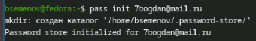
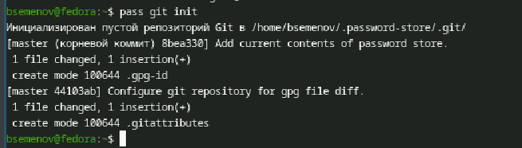
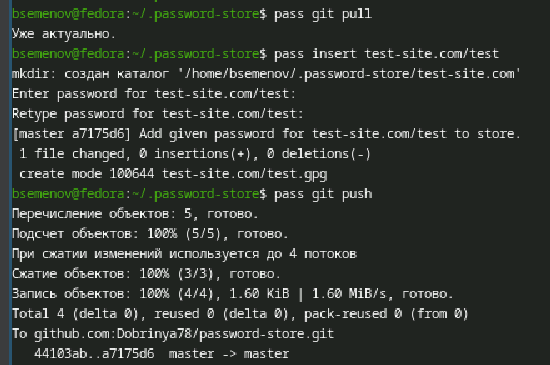
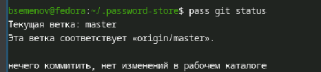
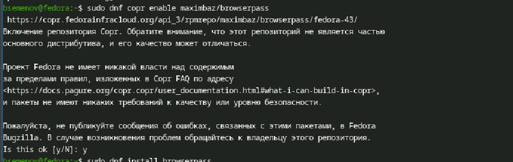
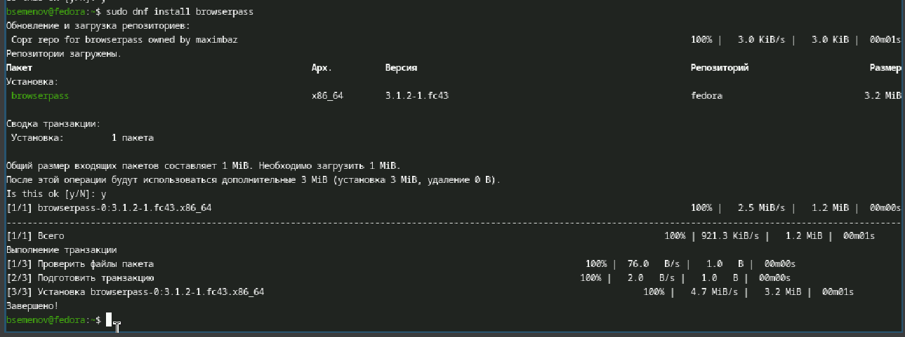
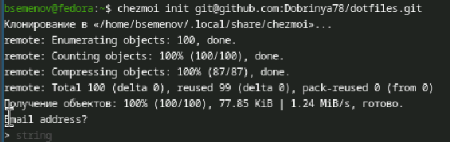
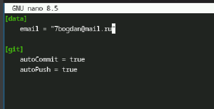
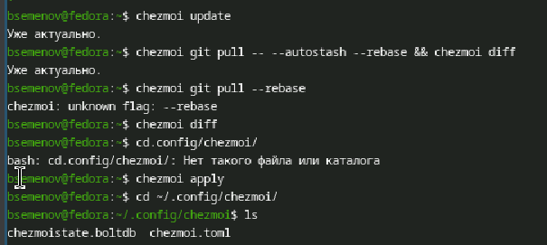

# Цель работы

Настройка рабочей среды.

# Задание

Установка и настройка pass/gopass (GPG, Git, browserpass) Освоение основных команд pass (добавление/просмотр паролей) Установка дополнительного ПО и шрифтов Установка chezmoi и создание репозитория dotfiles Инициализация chezmoi и применение конфигурации Настройка второй машины через chezmoi Освоение ежедневных операций chezmoi (update/diff/apply)

# Теоретическое введение

Менеджер паролей pass — это утилита командной строки для хранения и управления паролями, использующая GPG для шифрования и Git для синхронизации. Каждый пароль хранится в отдельном зашифрованном файле, организованном в древовидную структуру каталогов. Pass следует философии Unix: простые текстовые файлы, шифрование на основе открытых ключей и возможность интеграции с различными инструментами через расширения (например, pass-otp для одноразовых паролей).
 
Browserpass обеспечивает бесшовную интеграцию pass с веб-браузерами через механизм native messaging, позволяя автоматически заполнять формы входа.
 
Chezmoi — инструмент для управления dotfiles (конфигурационными файлами), который хранит их в Git-репозитории и позволяет применять на разных машинах с учётом их особенностей. В отличие от простого копирования файлов, chezmoi поддерживает шаблонизацию, позволяя использовать разные настройки для разных компьютеров, и обеспечивает безопасное хранение чувствительных данных.

# Выполнение лабораторной работы

1)Установка pass ([рис. @fig-001]).

{#fig-001 width=70%}

2)Установка gopass ([рис. @fig-002]).

{#fig-002 width=70%}

3)Просмотр списка ключей ([рис. @fig-003]).

{#fig-003 width=70%}

4)Инициализируем хранилище ([рис. @fig-004]).

{#fig-004 width=70%}

5)Создадим структуру git([рис. @fig-005]).

{#fig-005 width=70%}

6)Для синхронизации выполняется следующая команда ([рис. @fig-006]).

{#fig-006 width=70%}

7)Проверим статус синхронизации ([рис. @fig-007]).

{#fig-007 width=70%}

8)Настройка интерфейса с браузером ([рис. @fig-008]).

{#fig-008 width=70%}

9)Установка browserpass ([рис. @fig-009]).

{#fig-009 width=70%}

10)Установим дополнительное ПО ([рис. @fig-010]).

{#fig-010 width=70%}

11)Использование chezmoi ([рис. @fig-011]).

{#fig-011 width=70%}

12)Добавил свою почту ([рис. @fig-012]).

{#fig-012 width=70%}

13)Ежедневные операции ([рис. @fig-013]).

{#fig-013 width=70%}

# Выводы

Освоена работа с pass (хранение паролей, GPG, Git) и chezmoi (управление dotfiles). Настроена синхронизация конфигураций между машинами и интеграция с браузером.

# Список литературы
