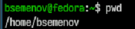
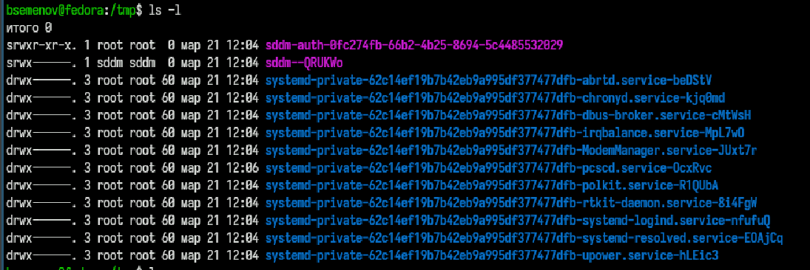
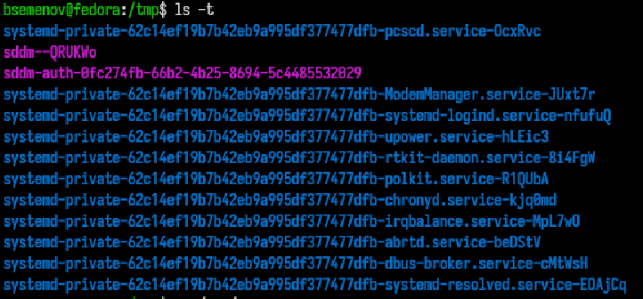
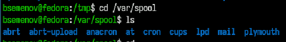
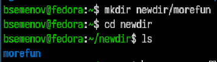
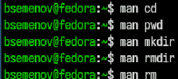
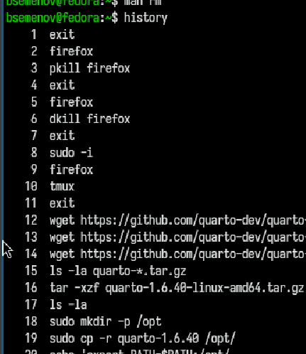

---
## Front matter
lang: ru-RU
title: Отчет по лабораторной работе №6
subtitle: Операционные системы
author:
  - Семенов Богдан
institute:
  - Российский университет дружбы народов, Москва, Россия

## i18n babel
babel-lang: russian
babel-otherlangs: english

## Formatting pdf
toc: false
toc-title: Содержание
slide_level: 2
aspectratio: 169
section-titles: true
theme: metropolis
header-includes:
 - \metroset{progressbar=frametitle,sectionpage=progressbar,numbering=fraction}
---

# Информация

## Докладчик

  * Семенов Богдан
  * НКАбд-05-25, Студенческий билет: 1032255197
  * Российский университет дружбы народов
  
## Цель работы

Приобретение практических навыков взаимодействия пользователя с системой по-
средством командной строки.

## Выполнение лабораторной работы

##

1)Выполнение команды pwd (рис. 1).

{#fig-001 width=70%}

##

Переходим в папку `tmp` (рис. 2).

{#fig-002 width=70%}

##

Проверяем что находится в папке `ls` (рис. 3).

{#fig-003 width=70%}

##

ls -l (рис. 4).

{#fig-004 width=70%}

##

ls -lh (рис. 5).

{#fig-005 width=70%}

##

ls -t (рис. 6).

{#fig-006 width=70%}

##

Переходим в папку `cd /var/spool` и проверяем `ls`(рис. 7).

{#fig-007 width=70%}

##

Создаем новую папку `mkdir newdir` и проверяем `ls`(рис. 8).

{#fig-008 width=70%}

##

Создаем еще новую папку в новой папке, переходим в нее и проверяем содержимое(рис. 9).

{#fig-009 width=70%}

##

Создаем сразу 3 папки и проверяем (рис. 10).

{#fig-010 width=70%}

##

Удаляем только что созданиые 3 папки и проверяем (рис. 11).

{#fig-011 width=70%}

##

Выполняем удаление содержимое в папке затем саму папку и проверяем (рис. 12).

{#fig-012 width=70%}

##

Смотрим какие команды мы можем в будущем использовать (рис. 13).

{#fig-013 width=70%}

##

Смотрим историю введеных команд (рис. 14).

{#fig-014 width=70%}

##

Изменяем в истории удаление папок на создание и проверяем их наличие (рис. 15).

{#fig-015 width=70%}

# Выводы

Я приобрел практические навыки взаимодействия пользователя с системой посредством командной строки.

# Список литературы
