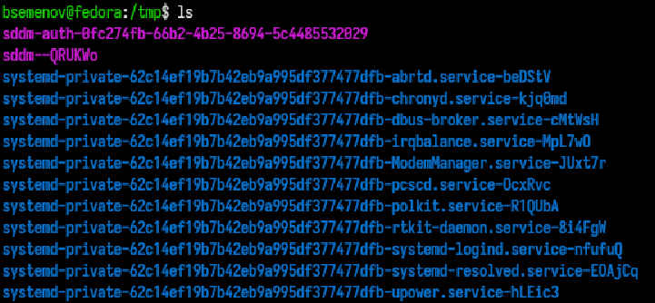
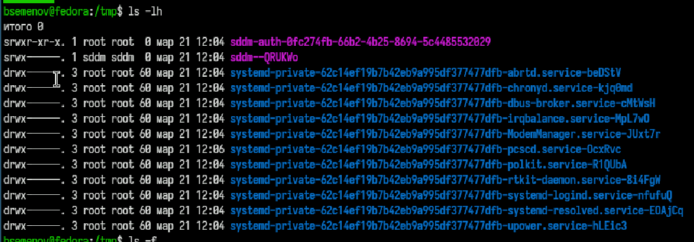
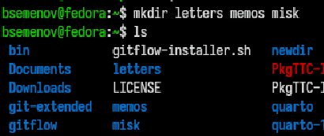
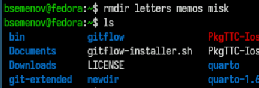
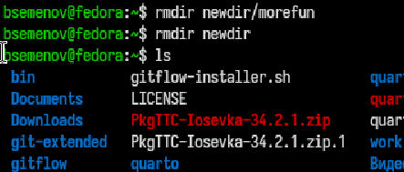
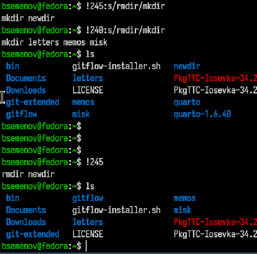

# Цель работы

Приобретение практических навыков взаимодействия пользователя с системой по-
средством командной строки.

# Задание

1. Определите полное имя вашего домашнего каталога. Далее относительно этого ката-
лога будут выполняться последующие упражнения.
2. Выполните следующие действия:
2.1. Перейдите в каталог /tmp.
2.2. Выведите на экран содержимое каталога /tmp. Для этого используйте команду ls
с различными опциями. Поясните разницу в выводимой на экран информации.
2.3. Определите, есть ли в каталоге /var/spool подкаталог с именем cron?
2.4. Перейдите в Ваш домашний каталог и выведите на экран его содержимое. Опре-
делите, кто является владельцем файлов и подкаталогов?
3. Выполните следующие действия:
3.1. В домашнем каталоге создайте новый каталог с именем newdir.
3.2. В каталоге ~/newdir создайте новый каталог с именем morefun.
3.3. В домашнем каталоге создайте одной командой три новых каталога с именами
letters, memos, misk. Затем удалите эти каталоги одной командой.
3.4. Попробуйте удалить ранее созданный каталог ~/newdir командой rm. Проверьте,
был ли каталог удалён.
3.5. Удалите каталог ~/newdir/morefun из домашнего каталога. Проверьте, был ли
каталог удалён.
4. С помощью команды man определите, какую опцию команды ls нужно использо-
вать для просмотра содержимое не только указанного каталога, но и подкаталогов,
входящих в него.
5. С помощью команды man определите набор опций команды ls, позволяющий отсорти-
ровать по времени последнего изменения выводимый список содержимого каталога
с развёрнутым описанием файлов.
6. Используйте команду man для просмотра описания следующих команд: cd, pwd, mkdir,
rmdir, rm. Поясните основные опции этих команд.
7. Используя информацию, полученную при помощи команды history, выполните мо-
дификацию и исполнение нескольких команд из буфера команд.

# Теоретическое введение

В операционной системе типа Linux взаимодействие пользователя с системой обычно
осуществляется с помощью командной строки посредством построчного ввода ко-
манд. При этом обычно используется командные интерпретаторы языка shell: /bin/sh;
/bin/csh; /bin/ksh.

# Выполнение лабораторной работы

1)Выполнение команды pwd ([рис. @fig-001]).

{#fig-001 width=70%}

2)Переходим в папку `tmp` ([рис. @fig-002]).

{#fig-002 width=70%}

3)Проверяем что находится в папке `ls` ([рис. @fig-003]).

{#fig-003 width=70%}

4)ls -l ([рис. @fig-004]).

{#fig-004 width=70%}

5)ls -lh ([рис. @fig-005]).

{#fig-005 width=70%}

6)ls -t ([рис. @fig-006]).

{#fig-006 width=70%}

7)Переходим в папку `cd /var/spool` и проверяем `ls`([рис. @fig-007]).

{#fig-007 width=70%}

8)Создаем новую папку `mkdir newdir` и проверяем `ls`([рис. @fig-008]).

{#fig-008 width=70%}

9)Создаем еще новую папку в новой папке, переходим в нее и проверяем содержимое([рис. @fig-009]).

{#fig-009 width=70%}

10)Создаем сразу 3 папки и проверяем ([рис. @fig-010]).

{#fig-010 width=70%}

11)Удаляем только что созданиые 3 папки и проверяем ([рис. @fig-011]).

{#fig-011 width=70%}

12)Выполняем удаление содержимое в папке затем саму папку и проверяем ([рис. @fig-012]).

{#fig-012 width=70%}

13)Смотрим какие команды мы можем в будущем использовать ([рис. @fig-013]).

{#fig-013 width=70%}

14)Смотрим историю введеных команд ([рис. @fig-014]).

{#fig-014 width=70%}

15)Изменяем в истории удаление папок на создание и проверяем их наличие ([рис. @fig-015]).

{#fig-015 width=70%}

# Выводы

Я приобрел практические навыки взаимодействия пользователя с системой посредством командной строки.

# Список литературы
