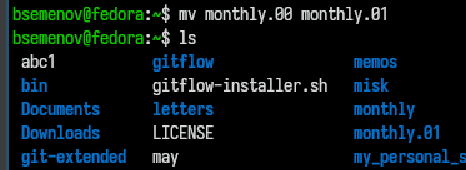
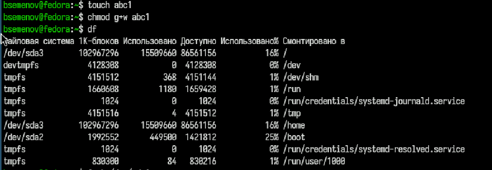
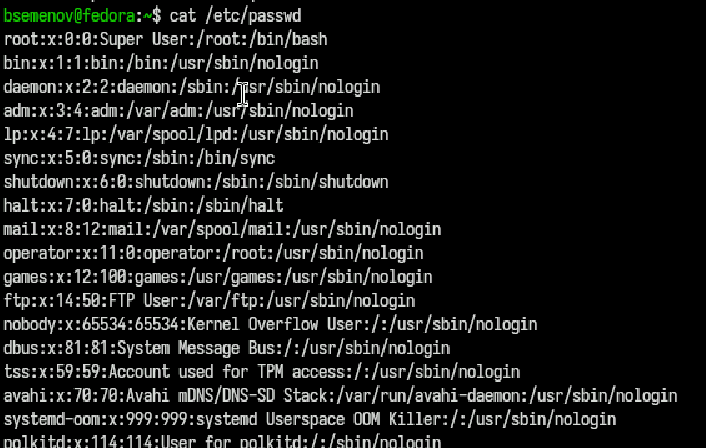
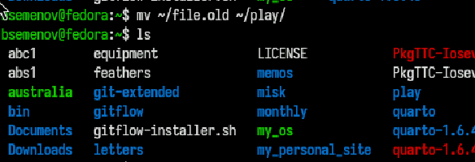
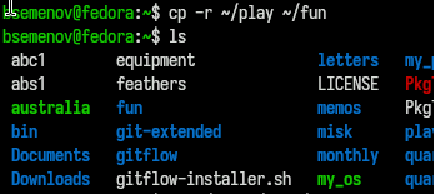

---
## Front matter
lang: ru-RU
title: Отчет по лабораторной работе №7
subtitle: Операционные системы
author:
  - Семенов Богдан
institute:
  - Российский университет дружбы народов, Москва, Россия

## i18n babel
babel-lang: russian
babel-otherlangs: english

## Formatting pdf
toc: false
toc-title: Содержание
slide_level: 2
aspectratio: 169
section-titles: true
theme: metropolis
header-includes:
 - \metroset{progressbar=frametitle,sectionpage=progressbar,numbering=fraction}
---

# Информация

## Докладчик

  * Семенов Богдан
  * НКАбд-05-25, Студенческий билет: 1032255197
  * Российский университет дружбы народов
  
## Цель работы

Ознакомление с файловой системой Linux, её структурой, именами и содержанием каталогов. Приобретение практических навыков по применению команд для работы с файлами и каталогами, по управлению процессами (и работами), по проверке использования диска и обслуживанию файловой системы.

## Выполнение лабораторной работы

##

1)Создаем пустой файл с именем абс1 (рис. 1).

{#fig-001 width=70%}

##

2)Создаем копию файла абс1 с именем апрель (рис. 2).

{#fig-002 width=70%}

##

3)Создаем папку, копируем туда файл апрель и май, копирует файл май в туже папку под именем июнь (рис. 3).

{#fig-003 width=70%}

##

4)Создаем новую папку с таким же именем только в конце (.00), далее копирует папку со всем содержимым в новую папку и смотрим что внутри. (рис. 4).

{#fig-004 width=70%}

##

5)Меняем имя папки с (.00) на (.01) и смотрим изменения (рис. 5).

{#fig-005 width=70%}

##

6)Создаем пустой файл, смотрим на его права далее мы предоставляем права и смотрим, лишаем прав и смотрим. (рис. 6).

{#fig-006 width=70%}

##

7)Создаем папку и лишаем прав (рис. 7).

{#fig-007 width=70%}

##

8)Создаем файл выделяем ему права и смотрим информацию (рис. 8).

{#fig-008 width=70%}

##

9)Проверка целостности файловой системы (рис. 9).

{#fig-009 width=70%}

##

10)Создаем 4 пустых файла и выделяем 1 права доступа далее смотрим на изменения (рис. 10).

{#fig-010 width=70%}

##

11)Выводим содержимое файла (рис. 11).

{#fig-011 width=70%}

##

12)Удаляем файла потом сразу создаем и смотрим на изменения (рис. 12).

{#fig-012 width=70%}

##

13)Перемещаем файл и наблюдаем изменения (рис. 13).

{#fig-013 width=70%}

##

14)Копируем содержимое папки в новую папку (рис. 14).

{#fig-014 width=70%}

##

15)Удаляем право на чтение файла и возвращаем (рис. 15).

{#fig-015 width=70%}

##

16)Удаляем право на чтение файла и возвращаем (рис. 16).

{#fig-016 width=70%}

##

17)Открываем справочные страницы всех команд (рис. 17).

{#fig-017 width=70%}

# Выводы

Мы познакомились с файловой системой Linux, её структурой, названиями и содержимым каталогов. Получили практические навыки по использованию команд для работы с файлами и каталогами, управлению процессами (и задачами), проверке использования диска и обслуживанию файловой системы.

# Список литературы
