# Цель работы

Ознакомление с файловой системой Linux, её структурой, именами и содержанием каталогов. Приобретение практических навыков по применению команд для работы с файлами и каталогами, по управлению процессами (и работами), по проверке использования диска и обслуживанию файловой системы.

# Задание

1. Выполните все примеры, приведённые в первой части описания лабораторной работы.
2. Выполните следующие действия, зафиксировав в отчёте по лабораторной работе
используемые при этом команды и результаты их выполнения:
2.1. Скопируйте файл /usr/include/sys/io.h в домашний каталог и назовите его
equipment. Если файла io.h нет, то используйте любой другой файл в каталоге
/usr/include/sys/ вместо него.
2.2. В домашнем каталоге создайте директорию ~/ski.plases.
2.3. Переместите файл equipment в каталог ~/ski.plases.
2.4. Переименуйте файл ~/ski.plases/equipment в ~/ski.plases/equiplist.
2.5. Создайте в домашнем каталоге файл abc1 и скопируйте его в каталог
~/ski.plases, назовите его equiplist2.
2.6. Создайте каталог с именем equipment в каталоге ~/ski.plases.
2.7. Переместите файлы ~/ski.plases/equiplist и equiplist2 в каталог
~/ski.plases/equipment.
2.8. Создайте и переместите каталог ~/newdir в каталог ~/ski.plases и назовите
его plans.
3. Определите опции команды chmod, необходимые для того, чтобы присвоить перечис-
ленным ниже файлам выделенные права доступа, считая, что в начале таких прав
нет:
3.1. drwxr--r-- ... australia
3.2. drwx--x--x ... play
3.3. -r-xr--r-- ... my_os
3.4. -rw-rw-r-- ... feathers
При необходимости создайте нужные файлы.
4. Проделайте приведённые ниже упражнения, записывая в отчёт по лабораторной
работе используемые при этом команды:
4.1. Просмотрите содержимое файла /etc/password.
4.2. Скопируйте файл ~/feathers в файл ~/file.old.
4.3. Переместите файл ~/file.old в каталог ~/play.
4.4. Скопируйте каталог ~/play в каталог ~/fun.
4.5. Переместите каталог ~/fun в каталог ~/play и назовите его games.
4.6. Лишите владельца файла ~/feathers права на чтение.
4.7. Что произойдёт, если вы попытаетесь просмотреть файл ~/feathers командой
cat?
4.8. Что произойдёт, если вы попытаетесь скопировать файл ~/feathers?
4.9. Дайте владельцу файла ~/feathers право на чтение.
4.10. Лишите владельца каталога ~/play права на выполнение.
4.11. Перейдите в каталог ~/play. Что произошло?
4.12. Дайте владельцу каталога ~/play право на выполнение.
5. Прочитайте man по командам mount, fsck, mkfs, kill и кратко их охарактеризуйте,
приведя примеры.

# Теоретическое введение

Файловая система в Linux состоит из файлов и каталогов. Каждому физическому носителю соответствует своя файловая система. Существует несколько типов файловых систем. Перечислим наиболее часто встречающиеся типы: – ext2fs (second extended filesystem); – ext3fs (third extended file system); – ext4 (fourth extended file system); – ReiserFS; – xfs; – fat (file allocation table); – ntfs (new technology file system). Для просмотра используемых в операционной системе  файловых систем можно воспользоваться командой mount без параметров.

# Выполнение лабораторной работы

1)Создаем пустой файл с именем абс1 ([рис. @fig-001]).

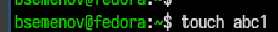{#fig-001 width=70%}

2)Создаем копию файла абс1 с именем апрель ([рис. @fig-002]).

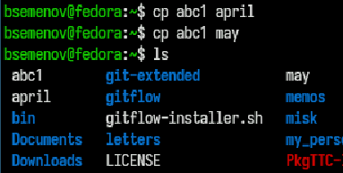{#fig-002 width=70%}

3)Создаем папку, копируем туда файл апрель и май, копирует файл май в туже папку под именем июнь ([рис. @fig-003]).

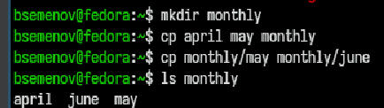{#fig-003 width=70%}

4)Создаем новую папку с таким же именем только в конце (.00), далее копирует папку со всем содержимым в новую папку и смотрим что внутри. ([рис. @fig-004]).

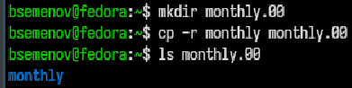{#fig-004 width=70%}

5)Меняем имя папки с (.00) на (.01) и смотрим изменения ([рис. @fig-005]).

{#fig-005 width=70%}

6)Создаем пустой файл, смотрим на его права далее мы предоставляем права и смотрим, лишаем прав и смотрим. ([рис. @fig-006]).

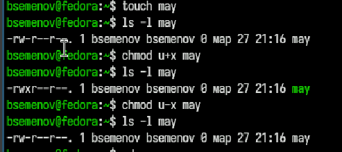{#fig-006 width=70%}

7)Создаем папку и лишаем прав ([рис. @fig-007]).

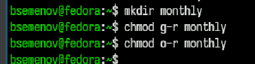{#fig-007 width=70%}

8)Создаем файл выделяем ему права и смотрим информацию ([рис. @fig-008]).

{#fig-008 width=70%}

9)Проверка целостности файловой системы ([рис. @fig-009]).

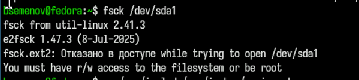{#fig-009 width=70%}

10)Создаем 4 пустых файла и выделяем 1 права доступа далее смотрим на изменения ([рис. @fig-010]).

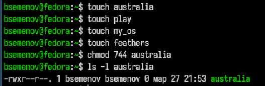{#fig-010 width=70%}

11)Выводим содержимое файла ([рис. @fig-011]).

{#fig-011 width=70%}

12)Удаляем файла потом сразу создаем и смотрим на изменения ([рис. @fig-012]).

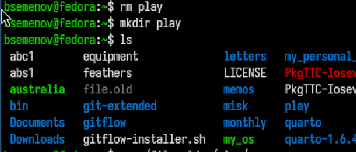{#fig-012 width=70%}

13)Перемещаем файл и наблюдаем изменения ([рис. @fig-013]).

{#fig-013 width=70%}

14)Копируем содержимое папки в новую папку ([рис. @fig-014]).

{#fig-014 width=70%}

15)Удаляем право на чтение файла и возвращаем ([рис. @fig-015]).

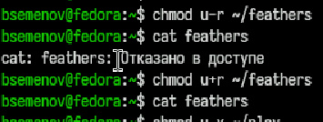{#fig-015 width=70%}

16)Удаляем право на чтение файла и возвращаем ([рис. @fig-016]).

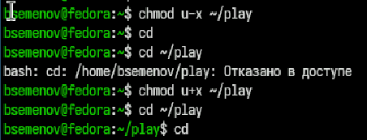{#fig-016 width=70%}

17)Открываем справочные страницы всех команд ([рис. @fig-017]).

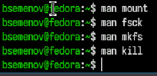{#fig-017 width=70%}

# Выводы

Мы познакомились с файловой системой Linux, её структурой, названиями и содержимым каталогов. Получили практические навыки по использованию команд для работы с файлами и каталогами, управлению процессами (и задачами), проверке использования диска и обслуживанию файловой системы.

# Список литературы
