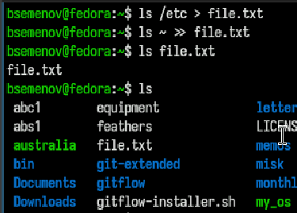
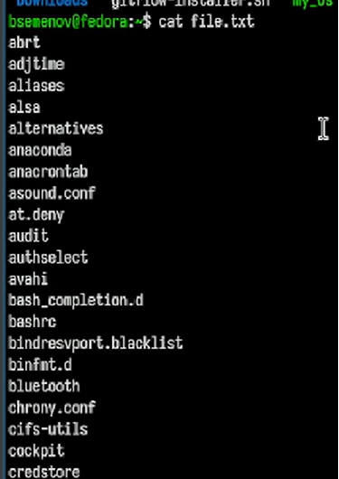
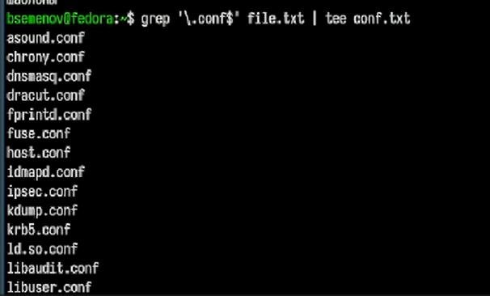
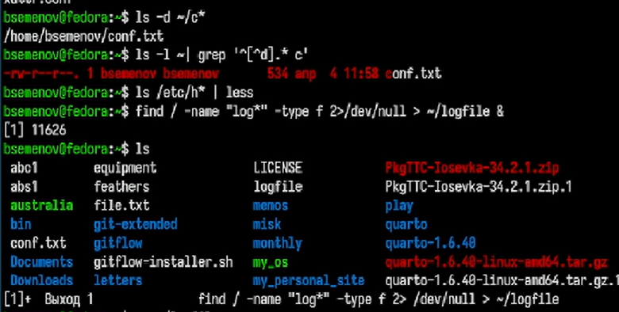
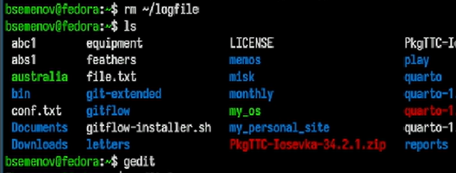
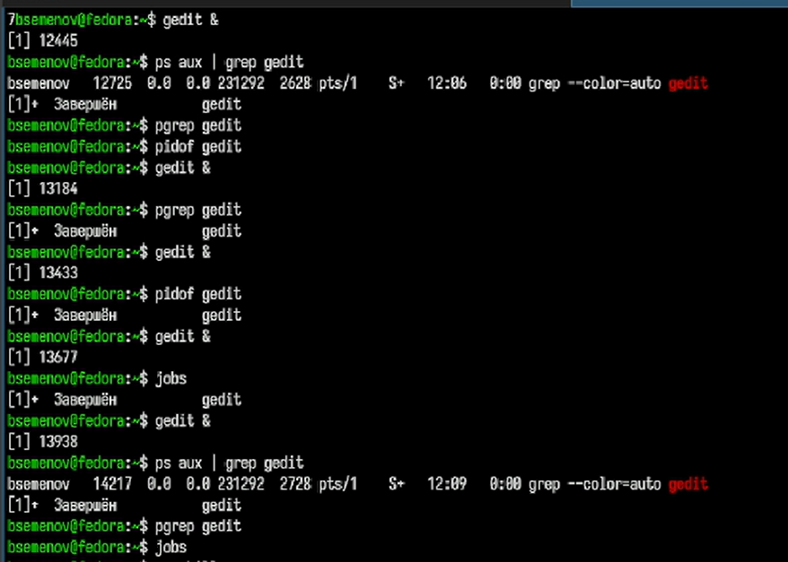
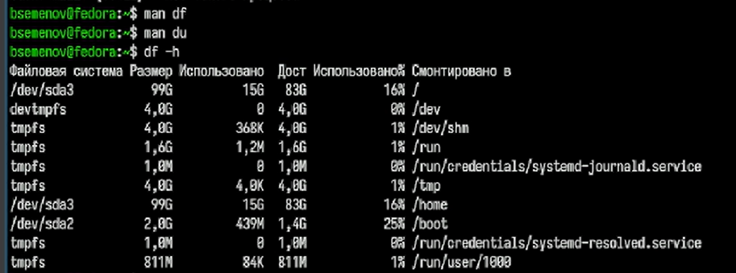
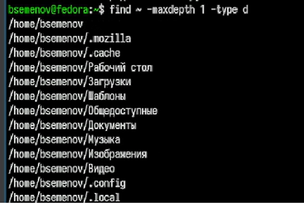

---
## Front matter
lang: ru-RU
title: Отчет по лабораторной работе №8
subtitle: Операционные системы
author:
  - Семенов Богдан
institute:
  - Российский университет дружбы народов, Москва, Россия

## i18n babel
babel-lang: russian
babel-otherlangs: english

## Formatting pdf
toc: false
toc-title: Содержание
slide_level: 2
aspectratio: 169
section-titles: true
theme: metropolis
header-includes:
 - \metroset{progressbar=frametitle,sectionpage=progressbar,numbering=fraction}
---

# Информация

## Докладчик

  * Семенов Богдан
  * НКАбд-05-25, Студенческий билет: 1032255197
  * Российский университет дружбы народов
  
## Цель работы

Ознакомление с инструментами поиска файлов и фильтрации текстовых данных. Приобретение практических навыков: по управлению процессами (и заданиями), по проверке использования диска и обслуживанию файловых систем.

## Выполнение лабораторной работы

##

1)Список содержимого каталога /etc записывается в файл file.txt далее добавляется в конец файла file.txt, выводит имя файла file.txt (рис. 1).

{#fig-001 width=70%}

##

2)Сat file.txt - выводит на экран содержимое файла (рис. 2).

{#fig-002 width=70%}

##

3)grep '\.conf$' file.txt | tee conf.txt — ищет в файле file.txt все строки, которые заканчиваются на .conf (рис. 3).

{#fig-003 width=70%}

##

4)Выводит список файлов и каталогов в домашней директории,  затем фильтрует строки через grep, показываем список файлов в каталоге /etc, имена которых начинаются с h, далее имена которых начинаются с log* (рис. 4).

{#fig-004 width=70%}

##

5)Удаляем файл logfile в домашней директории, затем смотри список всех файлов и   запускаем
текстовый редактор Gedit (рис. 5).

{#fig-005 width=70%}

##

6)Несколько раз запускаем gedit в фоновом режиме (с помощью &). Проверяет, запустился ли процесс, с помощью: ps aux | grep gedit — поиск процесса среди всех запущенных. pgrep gedit — поиск PID процесса по имени. pidof gedit — альтернативный способ получить PID (рис. 6).

{#fig-006 width=70%}

##

7)Открываем справочную страницу и смотрим команды и пытаемся завершить процесс, но он у нас и так завершен. (рис. 7].

{#fig-007 width=70%}

##

8)Открываем справочную страницу df и du смотрим на команды, далее выводим информацию о занятом и свободном месте на всех смонтированных файловых системах (рис. 8).

{#fig-008 width=70%}

##

9)Поиск в домашней директории, в выводе показаны найденные каталоги, включая саму домашнюю папку (рис. 9).

{#fig-009 width=70%}

# Выводы

Ознакомился с инструментами поиска файлов и фильтрации текстовых данных. Приобрёл практические навыки: по управлению процессами (и заданиями), по проверке использования диска и обслуживанию файловых систем.

# Список литературы
