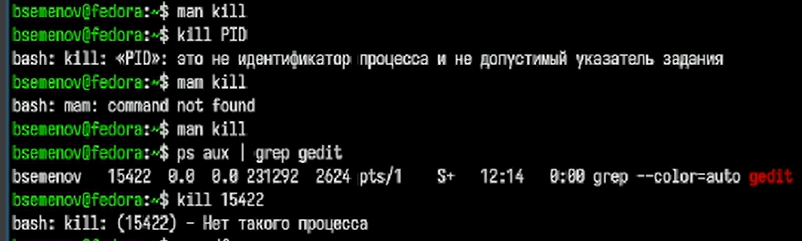

# Цель работы

Ознакомление с инструментами поиска файлов и фильтрации текстовых данных. Приобретение практических навыков: по управлению процессами (и заданиями), по проверке использования диска и обслуживанию файловых систем.

# Задание

1. Осуществите вход в систему, используя соответствующее имя пользователя.
2. Запишите в файл file.txt названия файлов, содержащихся в каталоге /etc. Допи-
шите в этот же файл названия файлов, содержащихся в вашем домашнем каталоге.
3. Выведите имена всех файлов из file.txt, имеющих расширение .conf, после чего
запишите их в новый текстовой файл conf.txt.
4. Определите, какие файлы в вашем домашнем каталоге имеют имена, начинавшиеся
с символа c? Предложите несколько вариантов, как это сделать.
5. Выведите на экран (по странично) имена файлов из каталога /etc, начинающиеся
с символа h.
6. Запустите в фоновом режиме процесс, который будет записывать в файл ~/logfile
файлы, имена которых начинаются с log.
7. Удалите файл ~/logfile.
8. Запустите из консоли в фоновом режиме редактор gedit.
9. Определите идентификатор процесса gedit, используя команду ps, конвейер и фильтр
grep. Как ещё можно определить идентификатор процесса?
10. Прочтите справку (man) команды kill, после чего используйте её для завершения
процесса gedit.
11. Выполните команды df и du, предварительно получив более подробную информацию
об этих командах, с помощью команды man.
12. Воспользовавшись справкой команды find, выведите имена всех директорий, имею-
щихся в вашем домашнем каталоге.

# Теоретическое введение

В системе по умолчанию открыто три специальных потока:
– stdin — стандартный поток ввода (по умолчанию: клавиатура), файловый дескриптор
0;
– stdout — стандартный поток вывода (по умолчанию: консоль), файловый дескриптор
1;
– stderr — стандартный поток вывод сообщений об ошибках (по умолчанию: консоль),
файловый дескриптор 2.
Большинство используемых в консоли команд и программ записывают результаты
своей работы в стандартный поток вывода stdout. Например, команда ls выводит в стан-
дартный поток вывода (консоль) список файлов в текущей директории. Потоки вывода
и ввода можно перенаправлять на другие файлы или устройства. Проще всего это делается
с помощью символов >, >>, <, <<.

# Выполнение лабораторной работы

1)Список содержимого каталога /etc записывается в файл file.txt далее добавляется в конец файла file.txt, выводит имя файла file.txt ([рис. @fig-001]).

{#fig-001 width=70%}

2)Сat file.txt - выводит на экран содержимое файла ([рис. @fig-002]).

{#fig-002 width=70%}

3)grep '\.conf$' file.txt | tee conf.txt — ищет в файле file.txt все строки, которые заканчиваются на .conf ([рис. @fig-003]).

{#fig-003 width=70%}

4)Выводит список файлов и каталогов в домашней директории,  затем фильтрует строки через grep, показываем список файлов в каталоге /etc, имена которых начинаются с h, далее имена которых начинаются с log* ([рис. @fig-004]).

{#fig-004 width=70%}

5)Удаляем файл logfile в домашней директории, затем смотри список всех файлов и   запускаем
текстовый редактор Gedit ([рис. @fig-005]).

{#fig-005 width=70%}

6)Несколько раз запускаем gedit в фоновом режиме (с помощью &). Проверяет, запустился ли процесс, с помощью: ps aux | grep gedit — поиск процесса среди всех запущенных. pgrep gedit — поиск PID процесса по имени. pidof gedit — альтернативный способ получить PID ([рис. @fig-006]).

{#fig-006 width=70%}

7)Открываем справочную страницу и смотрим команды и пытаемся завершить процесс, но он у нас и так завершен. ([рис. @fig-007]).

{#fig-007 width=70%}

8)Открываем справочную страницу df и du смотрим на команды, далее выводим информацию о занятом и свободном месте на всех смонтированных файловых системах ([рис. @fig-008]).

{#fig-008 width=70%}

9)Поиск в домашней директории, в выводе показаны найденные каталоги, включая саму домашнюю папку ([рис. @fig-009]).

{#fig-009 width=70%}

# Выводы

Ознакомился с инструментами поиска файлов и фильтрации текстовых данных. Приобрёл практические навыки: по управлению процессами (и заданиями), по проверке использования диска и обслуживанию файловых систем.

# Список литературы
