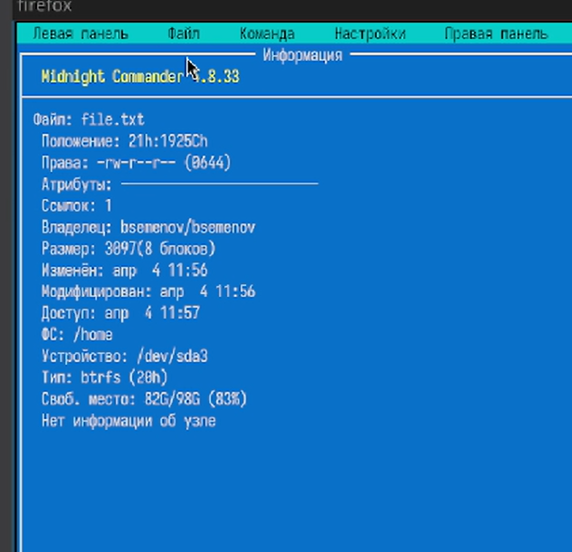
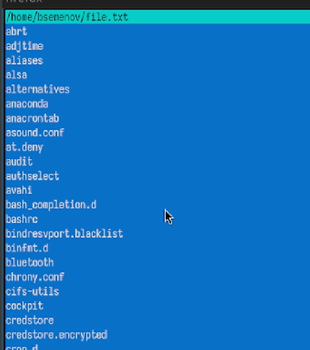
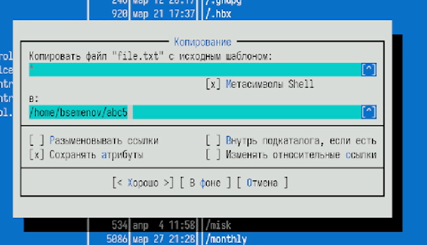
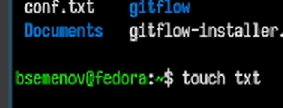

---
## Front matter
lang: ru-RU
title: Отчет по лабораторной работе №9
subtitle: Операционные системы
author:
  - Семенов Богдан
institute:
  - Российский университет дружбы народов, Москва, Россия

## i18n babel
babel-lang: russian
babel-otherlangs: english

## Formatting pdf
toc: false
toc-title: Содержание
slide_level: 2
aspectratio: 169
section-titles: true
theme: metropolis
header-includes:
 - \metroset{progressbar=frametitle,sectionpage=progressbar,numbering=fraction}
---

# Информация

## Докладчик

  * Семенов Богдан
  * НКАбд-05-25, Студенческий билет: 1032255197
  * Российский университет дружбы народов
  
## Цель работы

Освоение основных возможностей командной оболочки Midnight Commander. Приоб-
ретение навыков практической работы по просмотру каталогов и файлов; манипуляций
с ними.

## Выполнение лабораторной работы

##

1)Запуск man-страницы (рис. 1).

{#fig-001 width=70%}

##

2)В mc открыто окно «Компоновка файла "file.txt" (рис. 2).

{#fig-002 width=70%}

##

3)Отображена подробная информация о `file.txt` (рис. 3).

{#fig-003 width=70%}

##

4)список файлов и папок в `/home/bsemenov/` (рис. 4).

{#fig-004 width=70%}

##

5)«Контроль файла "file.txt" с исходным шаблоном» с похожими опциями и указанием целевого пути (рис. 5).

{#fig-005 width=70%}

##

6)В панели mc показан каталог `abc5`, содержащий файл `file.txt` (рис. 6).

{#fig-006 width=70%}

##

7)Выполнен поиск файлов `*.txt` с содержимым «nfs.conf» (рис. 7).

{#fig-007 width=70%}

##

8)Окно конфигурации: ориентация панелей, отображение строки меню, командной строки, меток клавиш, а также выбор цветовой схемы (скинов) (рис. 8).

{#fig-008 width=70%}

##

9)В панели mc отображаются `conf.txt`, `gitflow` и `gitflow-installer`, а в командной строке введена команда `touch txt` (рис. 9).

{#fig-009 width=70%}

##

10)Слева перечислены файлы `.pid`, справа – доступные цветовые схемы mc (рис. 10).

{#fig-010 width=70%}

##

11)Изменили скин (рис. 11).

{#fig-011 width=70%}

##

9)Поиск в домашней директории, в выводе показаны найденные каталоги, включая саму домашнюю папку (рис. 9).

{#fig-009 width=70%}

# Выводы

Я освоил основные возможности оболочки Midnight Commander. Приобрёл простые навыки работы: смотрю каталоги и файлы, управляю ими.

# Список литературы
