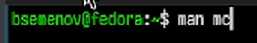
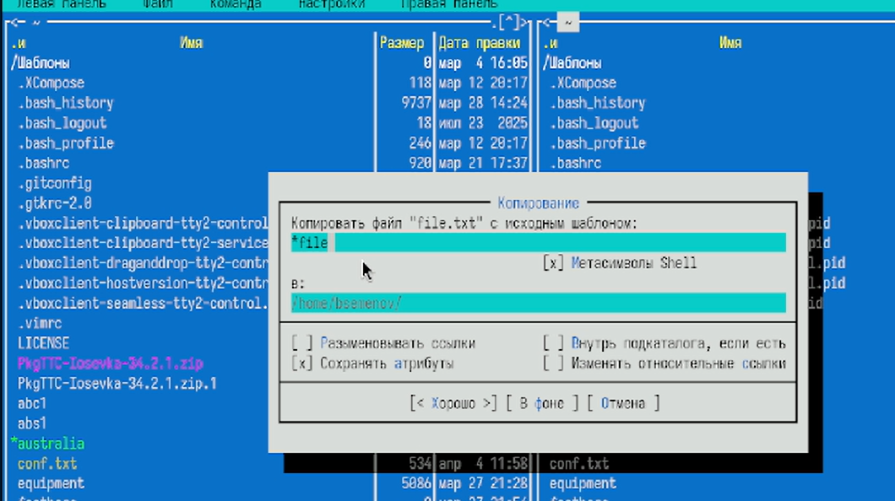
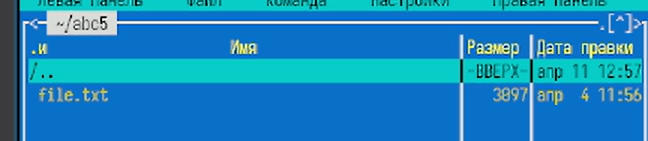
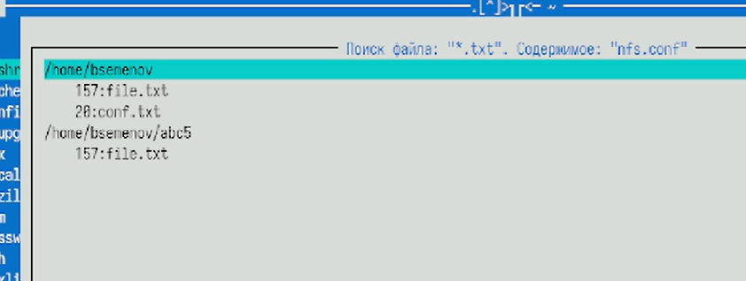
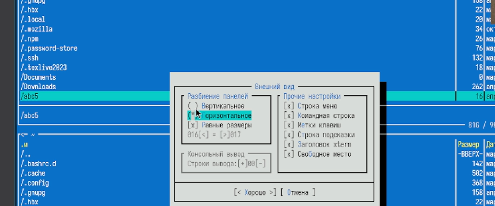
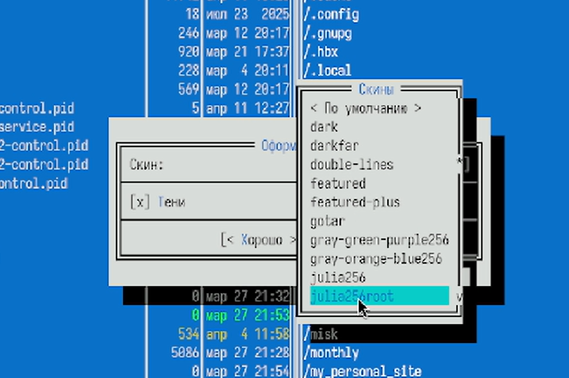
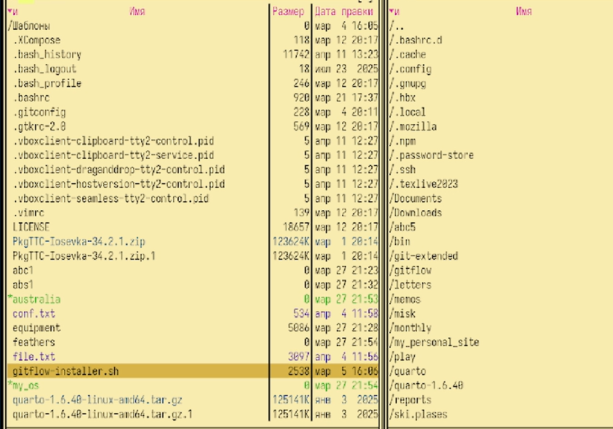

# Цель работы

Освоение основных возможностей командной оболочки Midnight Commander. Приоб-
ретение навыков практической работы по просмотру каталогов и файлов; манипуляций
с ними.

# Задание

3. Выполните несколько операций в mc, используя управляющие клавиши (операции
с панелями; выделение/отмена выделения файлов, копирование/перемещение фай-
лов, получение информации о размере и правах доступа на файлы и/или каталоги
и т.п.)
4. Выполните основные команды меню левой (или правой) панели. Оцените степень
подробности вывода информации о файлах.
5. Используя возможности подменю Файл , выполните:
– просмотр содержимого текстового файла;
– редактирование содержимого текстового файла (без сохранения результатов
редактирования);
– создание каталога;
– копирование в файлов в созданный каталог.
6. С помощью соответствующих средств подменю Команда осуществите:
– поиск в файловой системе файла с заданными условиями (например, файла
с расширением .c или .cpp, содержащего строку main);
– выбор и повторение одной из предыдущих команд;
– переход в домашний каталог;
– анализ файла меню и файла расширений.
7. Вызовите подменю Настройки . Освойте операции, определяющие структуру экрана mc
(Full screen, Double Width, Show Hidden Files и т.д.)ю
7.3.2. Задание по встроенному редактору mc
1. Создайте текстовой файл text.txt.
2. Откройте этот файл с помощью встроенного в mc редактора.
3. Вставьте в открытый файл небольшой фрагмент текста, скопированный из любого
другого файла или Интернета.
4. Проделайте с текстом следующие манипуляции, используя горячие клавиши:
4.1. Удалите строку текста.
4.2. Выделите фрагмент текста и скопируйте его на новую строку.
4.3. Выделите фрагмент текста и перенесите его на новую строку.
4.4. Сохраните файл.
4.5. Отмените последнее действие.
4.6. Перейдите в конец файла (нажав комбинацию клавиш) и напишите некоторый
текст.
4.7. Перейдите в начало файла (нажав комбинацию клавиш) и напишите некоторый
текст.
4.8. Сохраните и закройте файл.
5. Откройте файл с исходным текстом на некотором языке программирования (напри-
мер C или Java)
6. Используя меню редактора, включите подсветку синтаксиса, если она не включена,
или выключите, если она включена.

# Теоретическое введение

омандная оболочка — интерфейс взаимодействия пользователя с операционной систе-
мой и программным обеспечением посредством команд.
Midnight Commander (или mc) — псевдографическая командная оболочка для UNIX/Linux
систем. Для запуска mc необходимо в командной строке набрать mc и нажать Enter .
Рабочее пространство mc имеет две панели, отображающие по умолчанию списки
файлов двух каталогов

# Выполнение лабораторной работы

1)Запуск man-страницы ([рис. @fig-001]).

{#fig-001 width=70%}

2)В mc открыто окно «Компоновка файла "file.txt" ([рис. @fig-002]).

{#fig-002 width=70%}

3)Отображена подробная информация о `file.txt` ([рис. @fig-003]).

{#fig-003 width=70%}

4)список файлов и папок в `/home/bsemenov/` ([рис. @fig-004]).

{#fig-004 width=70%}

5)«Контроль файла "file.txt" с исходным шаблоном» с похожими опциями и указанием целевого пути ([рис. @fig-005]).

{#fig-005 width=70%}

6)В панели mc показан каталог `abc5`, содержащий файл `file.txt` ([рис. @fig-006]).

{#fig-006 width=70%}

7)Выполнен поиск файлов `*.txt` с содержимым «nfs.conf» ([рис. @fig-007]).

{#fig-007 width=70%}

8)Окно конфигурации: ориентация панелей, отображение строки меню, командной строки, меток клавиш, а также выбор цветовой схемы (скинов) ([рис. @fig-008]).

{#fig-008 width=70%}

9)В панели mc отображаются `conf.txt`, `gitflow` и `gitflow-installer`, а в командной строке введена команда `touch txt` ([рис. @fig-009]).

{#fig-009 width=70%}

10)Слева перечислены файлы `.pid`, справа – доступные цветовые схемы mc ([рис. @fig-010]).

{#fig-010 width=70%}

11)Изменили скин ([рис. @fig-011]).

{#fig-011 width=70%}

# Выводы

Я освоил основные возможности оболочки Midnight Commander. Приобрёл простые навыки работы: смотрю каталоги и файлы, управляю ими.

# Список литературы
